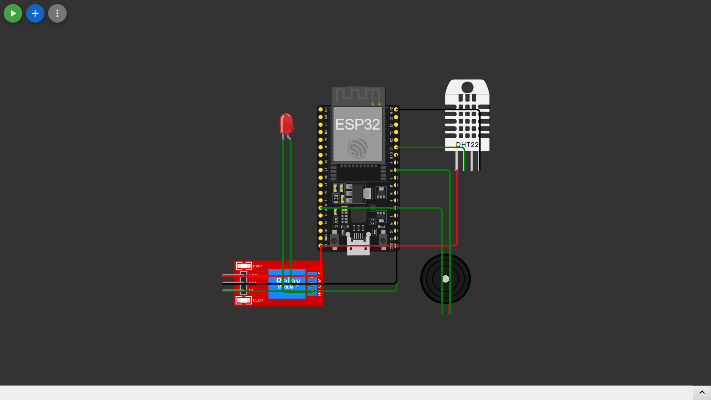

# Medidor de Temperatura e Umidade para Recém-nascidos

Este projeto monitora a temperatura e umidade de recém-nascidos, acionando um alarme (buzzer) caso a temperatura esteja fora da faixa segura e ligando um umidificador quando a umidade estiver baixa.  

## Componentes usados

- ESP32 DevKit v1
- Sensor DHT22 (temperatura e umidade)
- Buzzer piezo
- Módulo relé

## Diagrama de montagem

## Como usar

1. Abra `src/sketch.ino` no Wokwi ou Arduino IDE.
2. Configure os pinos conforme seu hardware.
3. Execute no simulador Wokwi ou carregue no ESP32.
4. O monitor serial exibirá temperatura, umidade e acionamentos do alarme/relé.

## Licença

MIT License
